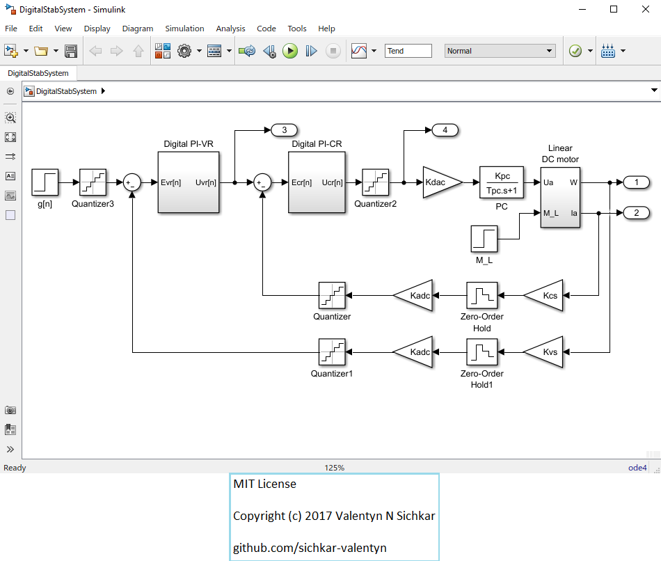

# Analysis of a digital stabilization system
Analysis of a digital stabilization system in Matlab using Simulink

### Courses:
* Explore the course **"Convolutional Neural Networks for Image Classification"** here: https://stepik.org/course/53801/promo

### Reference to:
[1] Valentyn N Sichkar. Analysis of a digital stabilization system in Matlab using Simulink // GitHub platform [Electronic resource]. URL: https://github.com/sichkar-valentyn/Analysis_of_a_digital_stabilization_system (date of access: XX.XX.XXXX)

## Description
A non-linear PI-VR and non-linear PI-CR are combined with a power controller to regulate the operation of a DC motor. Using these design constants, the system is analyzed with a step input.

Implementing a step input, a non-linear system with DC motor shows the following changes in response as the parameters g, Kadc, and Ts are adjusted independently. However, there may be additional interactions between these parameters, which is not explored.

<ul>
<li>As the parameter “g” is increased, the steady state velocity significantly increased. However, the initial overshoot also drastically increased.</li>
<li>As the parameter “Kadc” is increased, the steady state velocity significantly decreased. However, the initial overshoot also drastically decreased.</li>
<li>The effect of “Ts” is the strongest. If the value goes above approximately 0.003, the system becomes completely unstable.</li>
</ul>

## Digital Stab System

## MIT License
## Copyright (c) 2017 Valentyn N Sichkar
## github.com/sichkar-valentyn
### Reference to:
[1] Valentyn N Sichkar. Analysis of a digital stabilization system in Matlab using Simulink // GitHub platform [Electronic resource]. URL: https://github.com/sichkar-valentyn/Analysis_of_a_digital_stabilization_system (date of access: XX.XX.XXXX)
